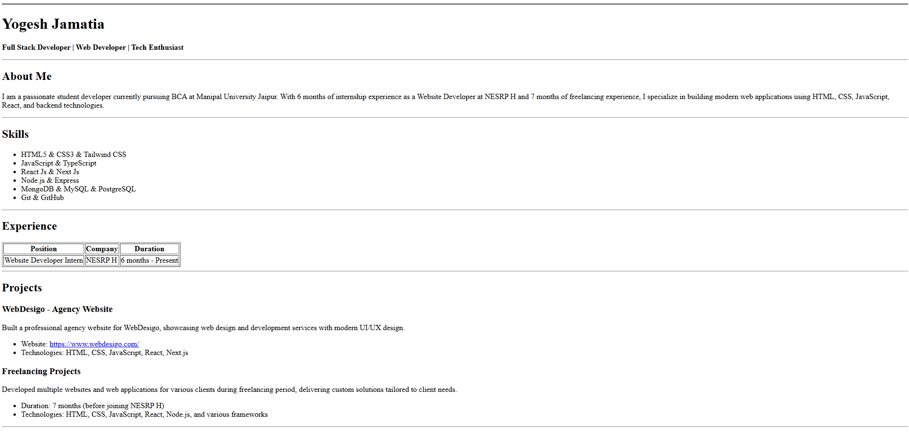

# HTML Resume Page Assignment

Building a single-page resume website in HTML, a cohort26 assignment.

## How to Open

Simply click the `index.html` file to open it in your default web browser.

or 

Use live server extension after downloading and open on vs code.

## HTML Tags Used

- `<!DOCTYPE html>` - Document type declaration
- `<html>` - Root element
- `<head>` - Document head section
- `<meta>` - Metadata tags
- `<title>` - Page title
- `<body>` - Document body
- `
` - Horizontal rule/line
- `<header>` - Header section
- `<h1>`, `<h2>`, `<h3>` - Headings (h1 for main title, h2 for section titles, h3 for subsections)
- `
` - Paragraph
- `<strong>` - Strong/bold text
- `<section>` - Content section
- `<ul>` - Unordered list
- `<li>` - List item
- `<table>` - Table
- `<thead>` - Table header
- `<tbody>` - Table body
- `<tr>` - Table row
- `<th>` - Table header cell
- `<td>` - Table data cell
- `<a>` - Anchor/link
- `<address>` - Contact information
- `<footer>` - Footer section
